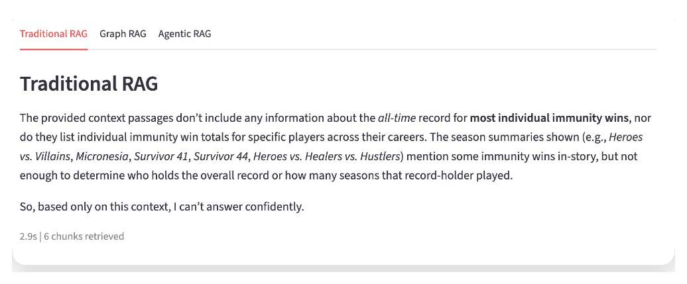
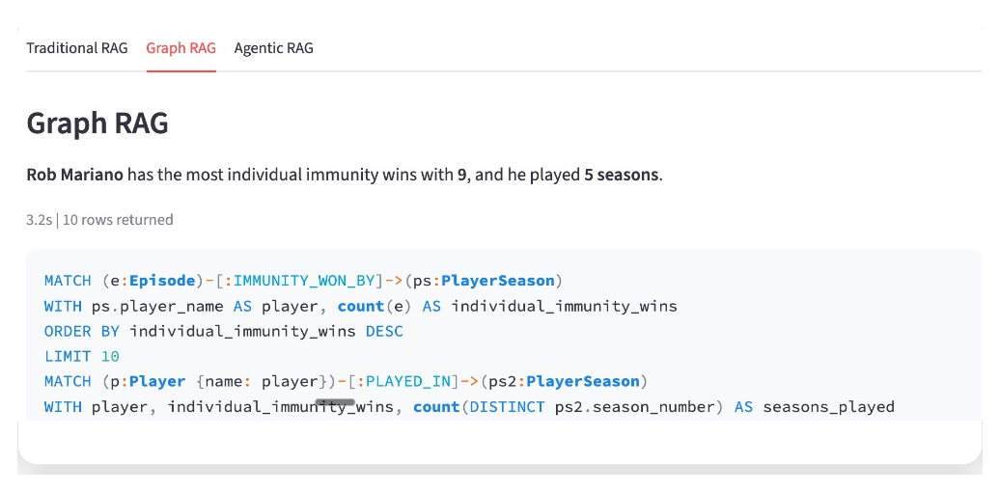
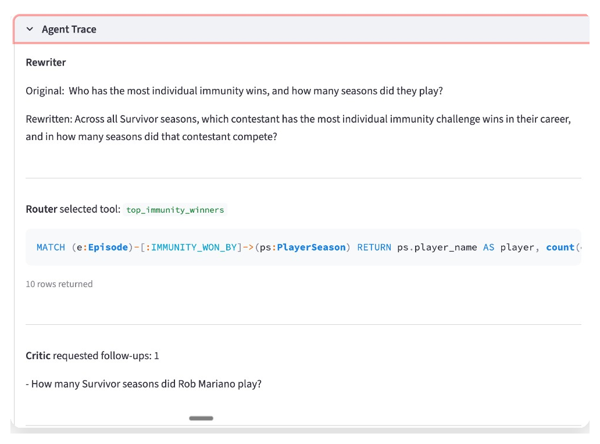

# The tribe has spoken: RAG alone can't answer the hard questions

Forty-nine seasons. 754 players. Thousands of tribal councils, blindsides, immunity runs, and jury votes. The TV show Survivor has a ton of structured data with connections running in every direction, which makes it a good stress test for how AI systems retrieve information.

We built an AI question-answering system on top of this data using three different retrieval strategies. Same questions, same domain, different results.

## What RAG is and where it breaks

If you've looked at AI products in the last two years, you've probably heard the term RAG, Retrieval Augmented Generation. The idea is simple: your LLM doesn't know your data, so before it answers a question, you go find the relevant bits and paste them into the prompt. The model reads those bits and writes an answer grounded in your actual information instead of its training data.

In practice, most RAG systems work like a search engine. You take all your documents, chop them into chunks, and convert each chunk into a vector, a mathematical fingerprint of what that chunk is about. When a question comes in, you convert it into a vector too, find the chunks with the closest fingerprints, and feed them to the model.

This works well when the answer lives in a paragraph somewhere. "What is our refund policy?" pulls up the refund policy page and the model summarizes it. Done.

Now picture a support bot for an insurance company. A customer calls and asks: "I filed a claim last March, my adjuster was replaced twice, and I still haven't gotten a resolution. What's going on with my case?"

The traditional RAG approach searches for text chunks that are semantically similar to that question. Maybe it finds a paragraph about claims processing timelines. Maybe a chunk from the company FAQ about adjuster assignments. But it has no idea which _specific_ claim this is, who the adjusters were, what the handoff dates looked like, or how those events connect to each other. It's matching words, not following a chain of events.

The moment a question involves specific entities, relationships between them, counts, comparisons, or a sequence of events, traditional RAG stops working.

## What a graph database gives you

A graph database stores data as nodes (things) and relationships (connections between things). We built a knowledge graph for the TV show Survivor, where 49 seasons of structured data turns into something like this:

- 754 `Player` nodes, each connected to one or more `PlayerSeason` records
- `Episode` nodes linked to `TribalCouncil` nodes, immunity wins, reward wins, and eliminations
- `Tribe` nodes connected to the players who were on them
- Vote relationships tracking who voted for whom and when

The schema looks like this in Neo4j's Cypher query language:

```cypher
(:Player)-[:PLAYED_IN]->(:PlayerSeason)-[:IN_SEASON]->(:Season)
(:PlayerSeason)-[:MEMBER_OF]->(:Tribe)
(:PlayerSeason)-[:CAST_VOTE]->(:PlayerSeason)
(:Episode)-[:IMMUNITY_WON_BY]->(:PlayerSeason)
```

In a graph the relationships are first-class data, not something you reconstruct at query time from a JOIN. "Who voted for whom in episode 5 of season 41" is one traversal, not a multi-table lookup.

## How we tested this

We built three retrieval approaches against the Survivor dataset and ran the same questions through all of them: traditional RAG, graph RAG, and an agentic layer on top of graph RAG. Here's how each one works.

### Traditional RAG

The simplest path. We chunked 49 Wikipedia season articles, embedded them, and stored them in pgvector. At query time we find the closest chunks and pass them to the model.

This is represented in about 15 lines of code:

```python
def query_traditional_rag(question):
    query_emb = embed_query(question)
    results = search_similar(query_emb, top_k=6)

    context_parts = []
    for r in results:
        context_parts.append(f"[{r['season_title']}]\n{r['content']}")
    context = "\n\n---\n\n".join(context_parts)

    answer = chat(
        "Answer using only the provided context.",
        f"Context:\n{context}\n\nQuestion: {question}",
    )
    return answer, results
```

This works well for narrative questions. "Why was Mike Skupin medevaced?" gets a good answer because the Wikipedia text has a paragraph about it. The vector search finds that paragraph and includes the relevant text to the LLM call.

But ask "How many total tribal councils have there been across all 49 seasons?" and it flails. There's no single paragraph with that number. The answer requires counting structured records, and traditional RAG has no way to count anything.

<p align="center">
  
</p>

### Graph RAG

Instead of just searching text, we ask the LLM to write the database query. We give it the graph schema, some examples, and the user's question. It writes Cypher (a graph database query language), we run it, and we include the results in the LLM call.

The core of it:

```python
def run_text2cypher(question):
    system_prompt = build_cypher_system_prompt()
    cypher = clean_cypher(chat(system_prompt, question))

    for attempt in range(1 + CYPHER_MAX_RETRIES):
        try:
            graph_results = run_query(cypher)
            if graph_results:
                break
        except Exception as e:
            repair_prompt = f"This Cypher failed:\n{cypher}\nError: {e}\nFix it."
            cypher = clean_cypher(chat(system_prompt, repair_prompt))

    return cypher, graph_results or []
```

Now "How many tribal councils total?" becomes `MATCH (tc:TribalCouncil) RETURN count(tc)` and you get an exact number. "List all winners and their jury vote counts" is a single Cypher query that traverses relationships directly. These are impossible with text retrieval alone.

The catch: when the LLM writes bad Cypher, things break silently. It might use a property name that doesn't exist, or filter too aggressively and return zero rows. We added retry logic to repair broken queries, but compound questions that need multiple aggregations still trip it up.

<p align="center">
  
</p>

### Agentic graph RAG

Plain graph RAG generates one Cypher query and hopes it's right. The agentic version treats the whole thing as an agent loop: the system has a goal (answer this question), a set of tools it can pick from, and a feedback step where it evaluates its own output and decides whether to keep going.

The tools are the interesting part. Instead of one strategy, the agent has three: predefined Cypher queries for common patterns, freeform text-to-Cypher for anything unusual, and full-text chunk search for narrative questions that don't need structured data at all. The LLM decides which tool fits the question using OpenAI's tool-calling API.

Predefined queries are where most of the reliability comes from. You write tested Cypher for the patterns you expect:

```python
def season_winner(season_number: int):
    cypher = (
        "MATCH (ps:PlayerSeason {season_number: $sn}) "
        "WHERE ps.exit_type = 'winner' "
        "RETURN ps.player_name AS winner, ps.season_number AS season"
    )
    return cypher, run_query(cypher, {"sn": season_number})
```

You start with your best guesses about what people will ask, then add or adjust these over time as you see real usage. Freeform Cypher generation still exists as a fallback, but the most common questions hit tested code paths.

Before any of the routing happens, the agent also rewrites the incoming question to be more specific. "Tell me about Ozzy" becomes "What seasons did Oscar 'Ozzy' Lusth compete in and how did he place?" That makes the router's job easier and improves the quality of the downstream query.

The feedback loop is the last piece. After the first retrieval, a critic checks whether the result actually answers the original question. Ask "Who won Survivor 45, and who were the jury members?" and the first pass retrieves the winner. The critic notices the jury data is missing and fires a second query. Two lookups, merged into one answer. Without the loop, you get half an answer and no way to know it's incomplete.

<p align="center">
  
</p>

## When each approach wins

| Question type                                                     | Traditional RAG | Graph RAG | Agentic RAG |
| ----------------------------------------------------------------- | --------------- | --------- | ----------- |
| Narrative ("Why was Skupin medevaced?")                           | Good            | Good      | Good        |
| Single fact ("Who won season 45?")                                | Hit or miss     | Good      | Good        |
| Aggregation ("Total tribal councils?")                            | No              | Good      | Good        |
| Multi-hop ("Most immunity wins, plus how many seasons?")          | No              | Sometimes | Good        |
| Cross-entity ("Players in 4+ seasons with the most reward wins?") | No              | Sometimes | Good        |

## The trade-offs

Traditional RAG is cheap and fast to set up. If your data is mostly unstructured text and your questions are "find me the relevant paragraph," it works great. The gap shows up when people ask questions that require counting, comparing, or chaining facts together.

Graph RAG is worth the extra engineering when your domain has real structure, things like entities and relationships, hierarchies, reference data. The cost is building and maintaining the graph, and managing the fragility of LLM-generated queries.

Agentic graph RAG reduces that fragility by routing common patterns to tested queries and only using freeform generation as a fallback. It costs more per query (more LLM calls) and takes more engineering to build the tool layer. But the reliability improvement on compound questions is real.

## The ingestion problem

In our case, getting the data into the graph took longer than building any of the retrieval logic. We first tried extracting structured data from Wikipedia HTML tables using an LLM to classify and normalize them. It worked for simple tables but fell apart on voting grids, inconsistent column names across 49 articles, and name mismatches ("Ozzy" in one table, "Oscar 'Ozzy' Lusth" in another).

We switched to the [survivoR R package](https://github.com/doehm/survivoR), a pre-cleaned dataset with consistent identifiers. The graph import runs in about 45 seconds with no LLM calls. Wikipedia articles still provide the text for traditional RAG and chunk search -- we just stopped trying to pull structured data out of them.

## When your users' questions outgrow text search

We used a TV show because it's fun and the data is public. But the pattern, entities with lots of connections where questions cut across records, shows up everywhere.

Take customer support. A customer has an account, multiple tickets, each ticket assigned to an agent, each agent in a department, some tickets escalated, some resolved, some reopened. "Show me every open ticket for customers on the Enterprise plan who've been escalated more than once in the last 90 days" is a graph traversal. Traditional RAG would need a miracle to find the right paragraphs for that.

Supply chain is the same story. A part is sourced from a supplier, that supplier depends on a sub-supplier in a specific region, that region is experiencing disruptions. "Which of our finished products are affected by the port delays in Shenzhen?" requires following the dependency chain from raw materials to finished goods.

Fraud detection is another good case. A transaction connects a buyer to a seller, the seller shares a bank account with another entity, that entity has flagged transactions. "Show me all accounts within two hops of this flagged transaction" is a few lines of Cypher.

In every case, the answer isn't hiding in a paragraph. It lives in the connections between records.

## Try it yourself

The full codebase is open source. One `make setup` to spin up Neo4j and Postgres, load the graph, and build the text indexes. One `make app` to launch the Streamlit UI where you can ask the same question in all three modes and compare the answers side by side.

[survivorgraph on GitHub](https://github.com/betaacid/survivorgraph)
