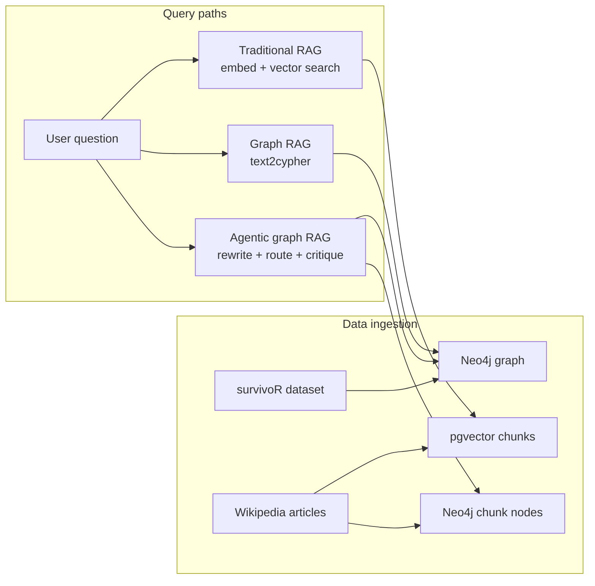

# Survivor graph RAG

This repo compares three retrieval styles against the same domain: traditional RAG, graph RAG, and agentic graph RAG. The domain is Survivor because it gives you both kinds of data you want for a demo like this. There is a lot of clean structure across 49 seasons, and there is also plenty of narrative text that does not fit neatly into a graph.

The main setup path uses two data sources on purpose:

- [`survivoR`](https://github.com/doehm/survivoR) for the structured graph in Neo4j
- Wikipedia season pages for the long-form text used by traditional RAG and graph chunk search

That split is the point of the repo. We tried building the graph straight from Wikipedia tables first. That code still exists under [`archive/`](archive/), but it is no longer the recommended setup.

## architecture



## quickstart

You need [uv](https://docs.astral.sh/uv/), Docker, Python 3.11+, and an OpenAI API key.

```bash
git clone <repo-url> && cd survivorgraph
uv sync
cp .env.example .env
```

Set `OPENAI_API_KEY` in `.env`, then run:

```bash
make setup
make app
```

The app opens at [http://localhost:8501](http://localhost:8501).

If you want to rerun the full import from a blank database, run `make reset` before `make setup`.

`make setup` does the full repo setup:

- starts Neo4j and Postgres
- imports the structured graph from `survivoR`
- downloads the Survivor Wikipedia season pages
- builds pgvector chunks for traditional RAG
- writes Wikipedia document and chunk nodes into Neo4j for graph and agentic chunk search

If you just want to rerun pieces of the pipeline, use:

```bash
make reset
make ingest
make demo
make test
```

## what each approach does

`Traditional RAG` uses the Wikipedia text only. It chunks the season pages, embeds them, stores them in pgvector, and answers with retrieved passages. It works best when the answer lives in a few paragraphs.

`Graph RAG` uses the Neo4j graph built from `survivoR`, plus chunk nodes from Wikipedia. It asks the model to write Cypher, runs that query, and then turns the rows into an answer. When the Cypher is right, it handles factual lookups, counts, and traversals well. When the Cypher is wrong, things fall apart fast.

`Agentic graph RAG` keeps the same graph, but it does more than fire off one freeform Cypher query and hope. It rewrites the question, routes it to a prebuilt tool when possible, checks whether the result actually answers the question, and can follow up if something is missing. It costs more per query, but it is noticeably steadier on multi-part questions.

The two text paths do not use the same chunking strategy. Traditional RAG uses word-window chunks for pgvector. Graph and agentic chunk search use section-aware chunks stored as `Chunk` nodes in Neo4j. That is intentional, but it matters when you compare retrieval behavior across modes.

## when each approach wins

| Question type                                                       | Traditional RAG | Graph RAG | Agentic RAG |
| ------------------------------------------------------------------- | --------------- | --------- | ----------- |
| Narrative ("Why was Skupin medevaced?")                             | Good            | Good      | Good        |
| Single fact ("Who won season 45?")                                  | Hit or miss     | Good      | Good        |
| Aggregation ("Total tribal councils across all seasons?")           | No              | Good      | Good        |
| Multi-hop ("Most immunity wins, and how many seasons did they play?") | No            | Sometimes | Good        |
| Cross-entity ("Players in 4+ seasons with the most reward wins?")   | No              | Sometimes | Good        |

The real split is simple. Narrative questions want text. Structured questions want Cypher. The agentic layer starts to matter when the question is compound enough that one generated Cypher query stops being a reliable plan.

## project structure

```text
app.py
lib/
  agentic_rag.py
  agentic_tools.py
  demo_questions.py
  graph_rag.py
  traditional_rag.py
  llm.py
  embeddings.py
  pg_client.py
  neo4j_client.py
  neo4j_ingest.py
  neo4j_schema.py
  neo4j_viz.py
  traditional_chunking.py
  utils.py
  wiki_chunking.py
  wiki_fetcher.py
scripts/
  reset.py
  01_ingest_graph.py
  02_download_wiki.py
  03_setup_traditional_rag.py
  04_ingest_wiki_chunks.py
  05_demo_queries.py
tests/
archive/
```

The main code paths to read are:

- [`Makefile`](Makefile)
- [`app.py`](app.py)
- [`lib/traditional_rag.py`](lib/traditional_rag.py)
- [`lib/graph_rag.py`](lib/graph_rag.py)
- [`lib/agentic_rag.py`](lib/agentic_rag.py)
- [`lib/agentic_tools.py`](lib/agentic_tools.py)
- [`scripts/01_ingest_graph.py`](scripts/01_ingest_graph.py)
- [`scripts/03_setup_traditional_rag.py`](scripts/03_setup_traditional_rag.py)
- [`scripts/04_ingest_wiki_chunks.py`](scripts/04_ingest_wiki_chunks.py)

## archived code

The original Wikipedia table-extraction path now lives under [`archive/wikipedia_graph_pipeline/`](archive/wikipedia_graph_pipeline/). That code tried to build the structured graph directly from raw Wikipedia tables with LLM normalization and custom parsers for the ugliest cases.

It was interesting, but not a good default for an example repo. The tables vary too much across seasons, and the failure modes are hard to explain cleanly to a new reader. `survivoR` gives the repo a much cleaner import path for the graph.

## tests

Run the test suite with:

```bash
make test
```
